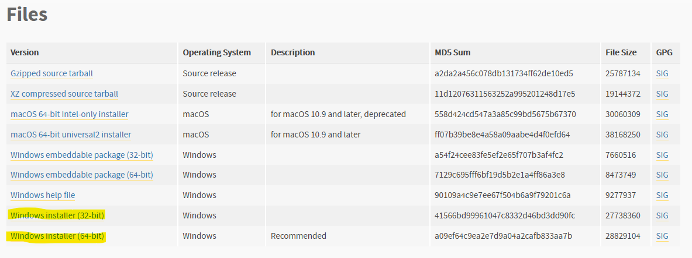
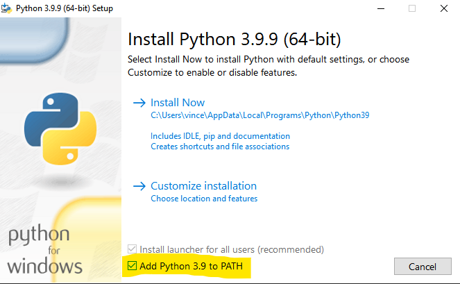
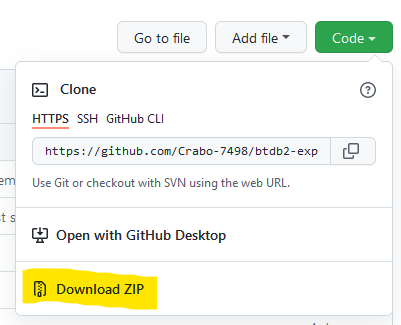

INSTALLATION
============

**IF YOU REQUIRE HELP, CONTACT `crabo_#7498` ON DISCORD**

## Windows

1. Download python 3.9 from [here](https://www.python.org/downloads/release/python-399/)
2. Scroll down and download one of the two (depending on your system)
 

3. **MAKE SURE TO ENABLE `Add Python 3.9 to PATH`, OTHERWISE THE BOT WILL NOT WORK**
 

4. Continue with installation and wait for it to finish
5. Return to the main page [here](https://github.com/Crabo-7498/btdb2-exp-grinder)
6. Download the package as ZIP and unpack it. You may also use GIT CLONE or GITHUB DESKTOP (If you know how to)
 

7. Open the folder and run `SETUP.bat`. Windows defender might block the program, in which case click `More Info > Run Anyways`
8. Follow the instructions presented to you
9. The software is now installed! (For how to run the software, consult [Running the software](#running-the-software)) 

## Running the Sotftware

**IMPORTANT: Make sure your screen resolution is 1980x1080**

1. Open BTDB2, make sure it is in windowed mode, instead of fullscreen. Also make sure the window is taking up the whole screen, instead of having it as a small window.
2. Run `EXEC.bat` and follow the instructions presented. Again, windows defender might stop the program from running, in which case select `More Info > Run Anyways`
3. Return to the BTDB2 window, making sure that no other window is visible.

If you are using a multi-monitor setup, make sure that you put BTDB2 in the leftmost monitor (that is also 1920x1080). You may put the terminal that pops up when running `EXEC.bat` in another monitor